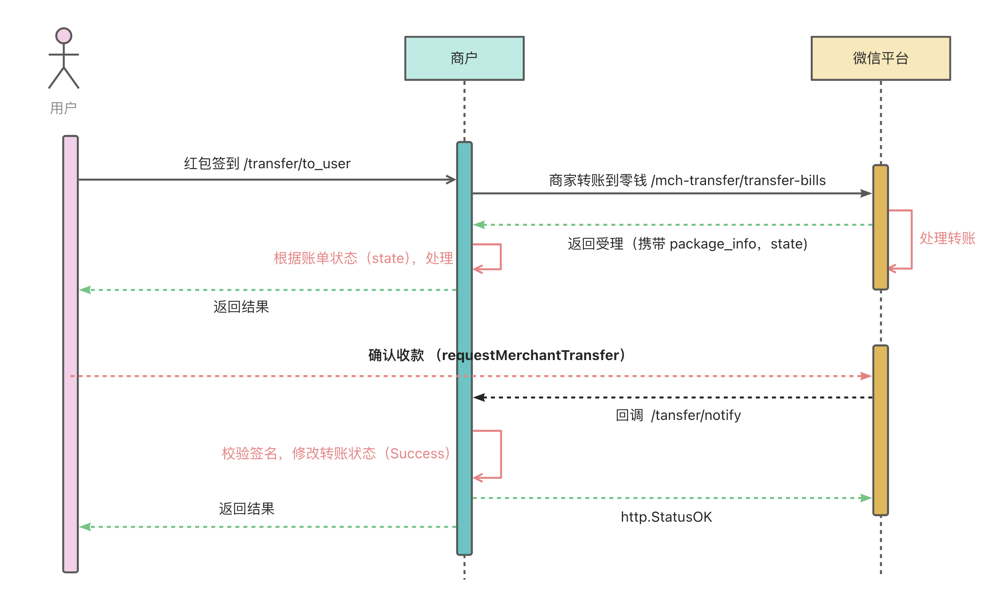
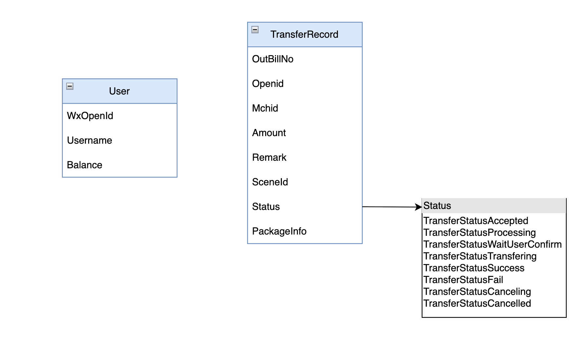
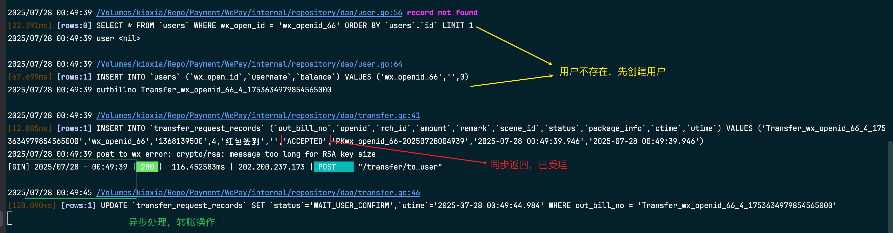
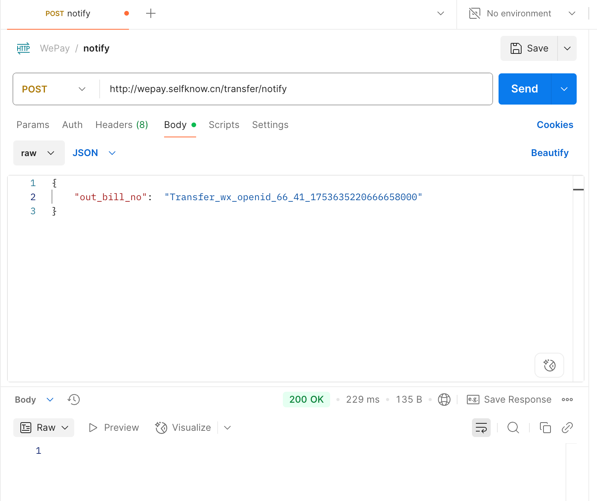
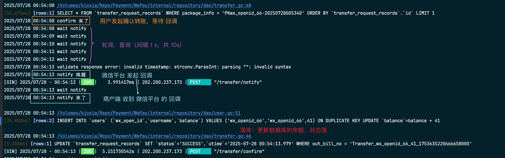
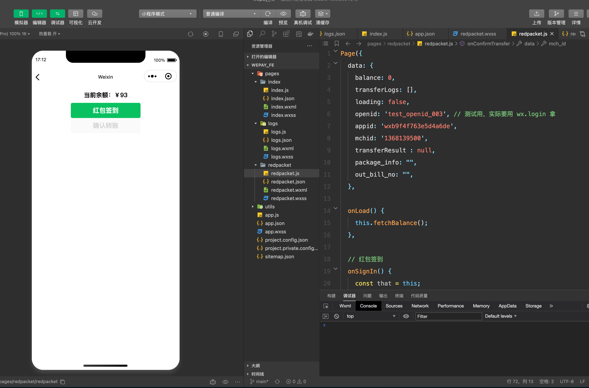
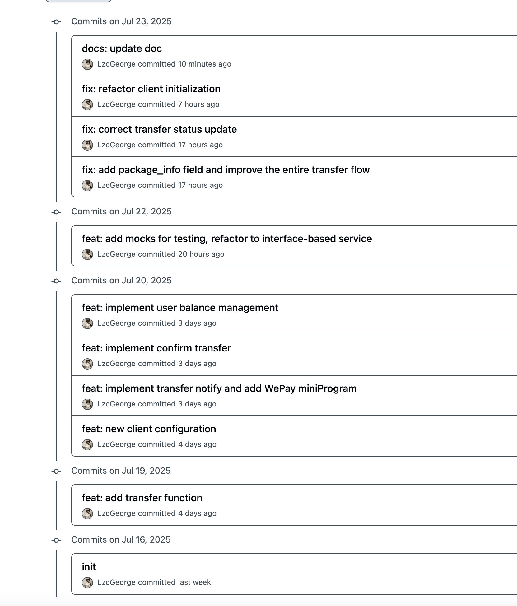
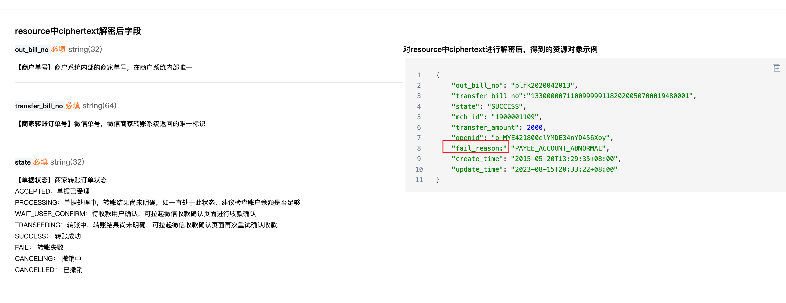
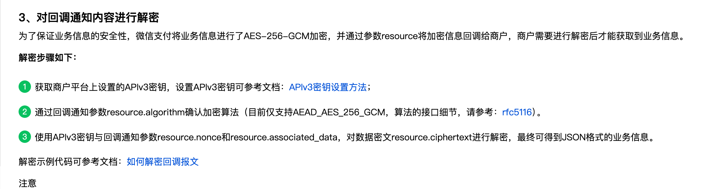

## 背景

1. 阅读链接的文档，理解产品形态 [微信支付V3: 商家转账到零钱 API 文档](https://pay.weixin.qq.com/doc/v3/merchant/4012711988) 
2. 你模拟一个商户，接入商家转账产品，完成功能：打开微信小程序之后，用户可以领取奖励，收到钱。（类似于淘宝签到领红包）
3. 交付件：设计文档、核心代码，以及对产品文档的改进建议


如何启动

- 数据库：`docker compose up`
- 后端：`go run main.go`
- 小程序：微信开发者平台
- 内网穿透：`./natapp --authtoken=5xxx`


## 整体架构



**通俗易懂版本：**

1. 小明点击红包签到（ 小程序向商户发送 `/transfer/to_user` 请求）
2. 商户接受到请求，
    - 处理请求，保存转账记录
    - 向 **微信平台** 发送转账请求 `/mch-transfer/transfer-bills` ，返回 `package_info` 和 `state`
    - 依据 `state` ，向用户返回结果
3. 小明看到收款确认信息
    - 确认收款，向 **微信平台** 发送确认收款 `/requestMerchantTransfer` （模拟实现：用 Channel 实现同步关系，创建一个 `confirmChans` 的通道）
    - **微信平台** 收到确认请求后，向 **商户** 发送回调 `/transfer/notify` 
    - **商户** 收到回调后（模拟实现：接收到 `notifyChans` 的通道传来的值之后），根据 `state` 进行后续操作（修改数据库中的状态），返回给 **用户** 转账结果。

> 详细版：
>
> 1. 用户发起红包签到
>
> - 用户在微信小程序内点击“红包签到”，发起签到请求。
> - 小程序向 **商户**（后端）发起 `/transfer/to_user` 接口请求。
>
> 2. 商户服务器处理转账
>
> - 商户服务端接收到请求，生成 **转账单号**，保存转账记录，调用微信商户转账API `mch-transfer/transfer-bills`，转账到用户零钱。
> - 微信平台处理转账，立即返回一个受理响应（同步），响应中携带 `package_info`（用于后续收款拉起）,`state`(商家转账订单状态）。
> - 当返回的商家转账订单状态为 `WAIT_USER_CONFIRM` 时，用户可以调用确认收款
>
> 3. 用户确认收款
>
> - 用户看到确认收款后，进行 **确认收款**
> - 小程序向 **微信平台** 发起 `requestMerchantTransfer` 接口请求
>
> 4. 微信和商户处理收款
>
> - 微信平台收到确认收款请求后，将转账结果通知给 **商户**
> - 微信平台利用之前 **商户发起转账的携带** `notify_url` 参数，进行回调（notify）
> - 商户服务器接收到回调，首先**验签**（保证消息来源可靠），然后根据通知内容**修改本地转账记录状态**（置为“Success”）。
> - 商户向微信平台返回状态码(`http.StatusOK`)
> - 商户根据转账状态，进行后续操作（修改转账记录表中的状态），返回用户结果。

### 技术栈

- 采用 **DDD（领域驱动设计） 架构**，项目分为 Domain、Repository、Service、Web 层，**实现业务逻辑与基础设施的解耦**，支持模块化扩展和后期重构。 设计原则：单一职责，依赖注入（DI），接口封装
- 后端：采用 `Gin` 作为 Web 框架，具有路由和中间件支持，开发效率高
- 前端：`微信小程序` ，利用微信的原生API 支持
- 数据库：`MySQL`，存储转账记录、用户等信息
- 单元测试：`Mock`
- 版本管理：使用 `Github` 进行版本管理

## 主要功能

### 数据模型设计



用户（User）

- WxOpenId（微信 openid，唯一索引）
- Balance ：用户余额

转账记录（TransferRecord）

- OutBillNo：商户订单号
- PackageInfo：跳转领取页面的package信息
- Status：转账的状态

商户信息配置（MchConfig）

```go
type MchConfig struct {
	mchId                      string          // 商户号
	certificateSerialNo        string          // 商户API证书序列号
	privateKeyFilePath         string          // 商户API证书对应的私钥文件路径
	wechatPayPublicKeyId       string          // 微信支付公钥ID
	wechatPayPublicKeyFilePath string          // 微信支付公钥文件路径
	privateKey                 *rsa.PrivateKey // 商户API证书对应的私钥
	wechatPayPublicKey         *rsa.PublicKey  // 微信支付公钥
}
```

通过 CreateMchConfig 方法进行初始化，读取本地密钥文件，加载为结构体属性，后续直接调用。

- 私钥签名：`func SignSHA256WithRSA(source string, privateKey *rsa.PrivateKey) (signature string, err error)`

- 公钥验证：`func VerifySHA256WithRSA(source string, signature string, publicKey *rsa.PublicKey) error `

- 构建请求头中的 Authorization：`BuildAuthorization`

     ```go
     authorization, err := BuildAuthorization(
        mchid,
        certificateSerialNo,
        privateKey,
        "POST",
        "/v3/pay/transactions/jsapi",
        body,
     )
     req.Header.Set("Authorization", authorization)
     ```

- 提取 Response 中的 Body: `func ExtractResponseBody(response *http.Response) ([]byte, error)`

- 微信支付回调校验(验证签名信息）：`ValidateResponse`

     ```go
     func ValidateResponse(
         wechatpayPublicKeyId string,
         wechatpayPublicKey *rsa.PublicKey,
         headers *http.Header,
         body []byte,
     ) error 
     ```

- 返回错误：`ApiException`

    ```go
    func NewApiException(statusCode int, header http.Header, body []byte) error
    ```


### 关键算法设计

#### 用户发起转账

发起转账 ：`func (t *TransferHandler) InitiateTransfer(ctx *gin.Context) ` 

- 输入：Openid，Amount（转账金额），Remark（备注），Time（时间戳）
- 步骤
    1. 校验参数完整性，完善其他参数设置
    2. 检验 Amount 是否合法（**防止前端篡改**）
    3. 生成 `OutBillNo（商户单号）` 
    4. 生成 `packageInfo` (原本应该是调用微信商户转账API 的 Response 中的，这里模拟，直接商户端生成了)
    5. 确认用户已经创建（UpsertUser）
    6. 保存下转账记录（落库）
    7. 构造微信商户转账需要的 TransferToUserRequest 对象，调用 API 接口
    8. **立即（同步）**返回一个组装好的 TransferToUserResponse 对象，此处的转账状态为 `TransferStatusAccepted`
    9. **异步修改转账状态** 为 `TransferStatusWaitUserConfirm`，表示微信平台等待确认收款

核心代码：

```go
var req struct {
    Openid string `form:"openid" json:"openid" binding:"required"`
    Amount int64  `form:"amount" json:"amount" binding:"required"`
    Remark string `json:"remark"`
    Time   string `json:"time" binding:"required"`
}

// 生成唯一outbillno, packageInfo并保存转账请求
	outbillno := t.svc.GenerateOutBillNo(req.Openid, req.Amount)
	packageInfo := generatePackageInfo(req.Openid, req.Time)

// 检查用户是否存在
t.userSvc.UpsertUser(ctx, req.Openid)

// 保存转账记录
err := t.svc.AddTransferRequest(ctx, requestRecord)

// 调用微信 API
_, err = t.svc.TransferToUser(t.client.MchConfig, request)

// 异步处理状态
ctx.JSON(http.StatusOK, response)

go func() {
    time.Sleep(30 * time.Second)
    t.svc.UpdateTransferStatus(ctx, outbillno, domain.TransferStatusTransfering)
}()
```

演示



#### 微信平台的回调

微信回调：`func (t *TransferHandler) TransferNotify(ctx *gin.Context)`

- 输入：OutBillNo
- 步骤
    1. 接收和校验参数
    2. 调用 **`wxpay_utility.ValidateResponse`** 对微信回调进行验签，防止伪造
    3. 查看小程序是否调用了确认转账的请求（查询 `confirmChans` 通道里面有没有值）
    4. 微信平台的回调（模拟实现：向 `notifyChans` 通道中写入值）
    5. 返回 `Http.StatusOK` ,告诉微信已成功接收通知。

核心代码：

```go
var req struct {
    OutBillNo string `json:"out_bill_no"  binding:"required"`
}
if err := ctx.ShouldBindJSON(&req); err != nil {
    ctx.JSON(400, gin.H{"code": "FAIL", "message": "invalid body"})
    return
}
// 2. 校验回调请求
headers := ctx.Request.Header
body, err := io.ReadAll(ctx.Request.Body)
if err != nil {
    ctx.JSON(http.StatusInternalServerError, err.Error())
    return
}
err = wxpay_utility.ValidateResponse(t.client.MchConfig.WechatPayPublicKeyId(), t.client.MchConfig.WechatPayPublicKey(), &headers, body)

// 是否有确认转账的请求
_, ok := t.confirmChans.Load(req.OutBillNo)
if !ok {
    log.Println("wait confirm")
    ctx.JSON(http.StatusOK, gin.H{"message": "wait confirm"})
    return
}

// 唤醒 notify 的协程
defer func() {
    t.notifyChans.Store(req.OutBillNo, make(chan struct{}))
    log.Println("notify 唤醒")
}()
```

演示



#### 用户确认收款

确认转账：`func (t *TransferHandler) ConfirmTransfer(ctx *gin.Context)`

- 输入：Mchid，Appid，PackageInfo
- 步骤
    1. 接收参数并校验
    2. 根据小程序传过来的 `PackageInfo` 拿到对应的转账记录
    3. **商户端** 向  **微信平台** 发送确认收款请求（这里本来应该是 **小程序** 直接调用确认收款请求`requestMerchantTransfer` 的，模拟实现：用 Channel 实现同步关系，创建一个 `confirmChans` 的通道）
    4. **商户端** 接收到 **微信平台** 的回调`/transfer/notify`，（模拟实现：接收到 `notifyChans` 的通道传来的值之后）
    5. 接收到回调通知后，转账记录上的状态为 `TransferStatusWaitUserConfirm` ，则更新余额，更新转账记录的状态为 `TransferStatusSuccess`
    6. 否则，返回失败。

核心代码

```go
var req struct {
    MchId       string `json:"mch_id" binding:"required"`
    Appid       string `json:"appid" binding:"required"`
    PackageInfo string `json:"package_info" binding:"required"`
}

// 唤醒 confirm 的通道
t.confirmChans.Store(record.OutBillNo, make(chan struct{}))

// 获取转账记录
record, err := t.svc.GetTransferRecordByPackageInfo(ctx, req.PackageInfo)

// 等待 notify 传来消息，限定在 10 s 内返回结果
timeout := time.After(10 * time.Second)
interval := 1 * time.Second
for {
    select {
    case <-timeout:
        ctx.JSON(http.StatusRequestTimeout, gin.H{"message": "超时未收到回调"})
        log.Println("超时未收到回调")
        return
    default:
        log.Println("wait notify")
        ch, ok := t.notifyChans.Load(record.OutBillNo)
        if ok {
            close(ch.(chan struct{}))
            t.notifyChans.Delete(record.OutBillNo)
            // notify 来了
            if record.Status == domain.TransferStatusWaitUserConfirm {
                // 如果状态为 TransferStatusWaitUserConfirm，则更新用户余额
                err := t.userSvc.UpdateBalance(ctx, record.Openid, record.Amount)
                ctx.JSON(http.StatusOK, gin.H{"message": "转账确认成功"})
                return
            } else {
                ctx.JSON(http.StatusInternalServerError, "转账状态不正确")
                log.Println("转账状态不正确")
                return
            }
        } else {
            time.Sleep(interval)
        }
    }
}
```

演示



### 前端设计



1. 用户在小程序端点“红包签到”，触发该请求。
2. 后端 `/transfer/to_user` 接口收到参数，发起一笔转账业务，并返回唯一的 `package_info` 标识。
3. 前端拿到 package_info，后续可用于 **确认转账**

```js
wx.request({
  url: 'http://wepay.selfknow.cn/transfer/to_user',
  method: 'POST',
  header: { 'content-type': 'application/json' },
  data: {
    openid: that.data.openid,
    amount:  Math.floor(Math.random() * 49) + 1,  // 分
    remark: '红包签到',
    time: time,
  },
  success: (res) => {
    console.log(res);
    if (res.data && res.data.package_info) {
      wx.showToast({ title: res.data.msg || '签到成功', icon: 'success' });
      this.setData({package_info: res.data.package_info})
      console.log(res.data.out_bill_no);
    } else {
      wx.showToast({ title: res.data.msg || '签到失败', icon: 'none' });
    }
  },
  fail: (err) => {
    wx.showToast({ title: '网络错误', icon: 'none' });
  },
  complete: () => {
    this.setData({ loading: false });
  }
});
```

## 总结

### 收获

- 首先通过查阅资料、代码，学习别人是如何写微信支付的
- 结合自己的习惯，整理思维逻辑，实现一个大体的框架
- 逐步实现每一个功能
- 修补bug，完善细节，梳理文档
- 分析，优化，提升。

学到了很多东西，在这个过程中不断地发现问题，解决问题，又发现问题，又解决问题.... 能力慢慢得到了提高，对业务的理解又提高了一个认识，同时也有一些感想。

`完成优先于完美` ：先简单的跑起来，然后再去做细节上的调整

`不谋全局者，不足以谋一域`：刚开始做的时候，想着先实现一个功能，后面的整体框架以后再说。做着做着就在想这个应该放在哪，那个应该放在哪，逻辑慢慢的就搞混了。 后面就重新梳理思路，把整个框架梳理清楚之后，再去逐步实现代码。





### Typo



- 应该是 `"fail_reason":`
- 地址：https://pay.weixin.qq.com/doc/v3/merchant/4012712115

### 后续



- [ ] 一些操作应该采用事务的操作，比如对两个表的修改
- [ ] 在小程序与商户进行交互的时候，实现对数据的加密（目前是明文传输）
- [ ] 在对回调通知内容上不够细致，没有对其进行解密（缺少 APIv3）


