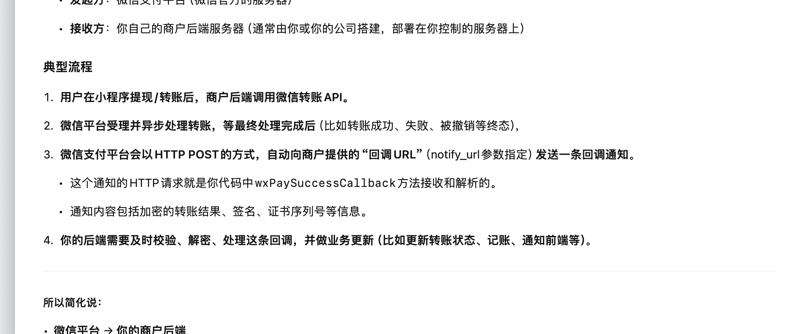

## 如何启动

- 数据库：`docker compose up`
- 后端：`go run main.go`
- 小程序：微信开发者平台
- 内网穿透：`./natapp --authtoken=5xxx`



**标准链路顺序**（配合 commit 顺序）：


1. 用户点击“签到”→ 后端生成转账，响应带 package_info。
2. 小程序保存 package_info。
3. 用户点击“确认转账”→ 拉起微信收款页面（或服务端完成模拟转账流程）。


## timeline

刚开始不知道 notify 如何处理，然后就找方案，也没有搭建起一个基本的架子，

搭建好架子，一步一步的开始理清楚了思路

脉络清楚了之后，慢慢的实现一个个功能（如 git commits 所示）

然后继续阅读文档，完善细节，修复bug

## 回调

当商户发起一笔转账请求后，微信支付平台并不会立即返回最终结果（例如用户是否成功收款）。为了确保业务系统的准确性与完整性，微信提供了**异步回调通知机制**。


## MchConfig

商品信息配置

```go
type MchConfig struct {
	mchId                      string          // 商户号
	certificateSerialNo        string          // 商户API证书序列号
	privateKeyFilePath         string          // 商户API证书对应的私钥文件路径
	wechatPayPublicKeyId       string          // 微信支付公钥ID
	wechatPayPublicKeyFilePath string          // 微信支付公钥文件路径
	privateKey                 *rsa.PrivateKey // 商户API证书对应的私钥
	wechatPayPublicKey         *rsa.PublicKey  // 微信支付公钥
}
```

通过 CreateMchConfig 方法进行初始化，读取本地密钥文件，加载为结构体属性，后续直接调用。

- 私钥签名：`func SignSHA256WithRSA(source string, privateKey *rsa.PrivateKey) (signature string, err error)`

- 公钥验证：`func VerifySHA256WithRSA(source string, signature string, publicKey *rsa.PublicKey) error `

- 构建请求头中的 Authorization：`BuildAuthorization`

     ```go
     authorization, err := BuildAuthorization(
        mchid,
        certificateSerialNo,
        privateKey,
        "POST",
        "/v3/pay/transactions/jsapi",
        body,
     )
     req.Header.Set("Authorization", authorization)
     ```

- 提取 Response 中的 Body: `func ExtractResponseBody(response *http.Response) ([]byte, error)`

- 微信支付回调校验(验证签名信息）：`ValidateResponse`

     ```go
     func ValidateResponse(
         wechatpayPublicKeyId string,
         wechatpayPublicKey *rsa.PublicKey,
         headers *http.Header,
         body []byte,
     ) error 
     ```

- 返回错误：`ApiException`

    ```go
    func NewApiException(statusCode int, header http.Header, body []byte) error
    ```

    


** 加解密与签名**


- EncryptOAEPWithPublicKey：公钥加密，用于传递敏感信息
- SignSHA256WithRSA、VerifySHA256WithRSA：用于生成签名、校验签名（SHA256-RSA）
- BuildAuthorization：生成微信支付 v3 需要的 Authorization 头（签名）


### **5. 微信应答验签**


- ValidateResponse：验证微信支付应答的签名，**防止伪造回包**，保证安全
- 校验签名、时间戳、证书序列号，签名串拼接细节和微信支付文档完全一致


### **6. 工具方法**


- 生成随机字符串（nonce）、复制指针等
- 错误处理封装成 ApiException 结构体，便于业务层感知详细错误


------


## **实际业务意义**


1. **安全第一**

    微信支付全流程都要做签名、验签，公钥、私钥、证书 ID 等都需要正确传递和校验，才能防止中间人攻击、重放攻击、伪造通知等安全风险。

2. **依赖倒置、易于测试**

    通过接口隔离、mock 可控，方便你的单元测试和 mock（如 gomock），不用真的连接微信就能测试主流程。

3. **功能可复用**

    商户配置和加解密、签名是所有微信支付接口的通用需求，本模块可直接用于转账、收款、退款、通知回调等所有微信支付场景。


------


## **举例**


比如你在调用“企业付款到用户”接口时，


1. 你用 CreateMchConfig 生成商户配置，得到证书和私钥
2. 用 BuildAuthorization 生成签名串
3. 用 MchConfigInterface 接口传给主流程
4. 主流程只依赖接口，不关心底层密钥怎么来的
5. 回包用 ValidateResponse 验签，保证微信服务器真的给你回的


------


### **总结一句**


这段代码就是**安全、标准、可测试的微信支付配置与加解密模块**，让你的支付/转账等接口开发简单又安全。

你只要传配置信息，剩下的签名、加解密、验签细节都被封装好了。


------


如需**mock测试写法**或**如何注入到业务流程**可以继续问！